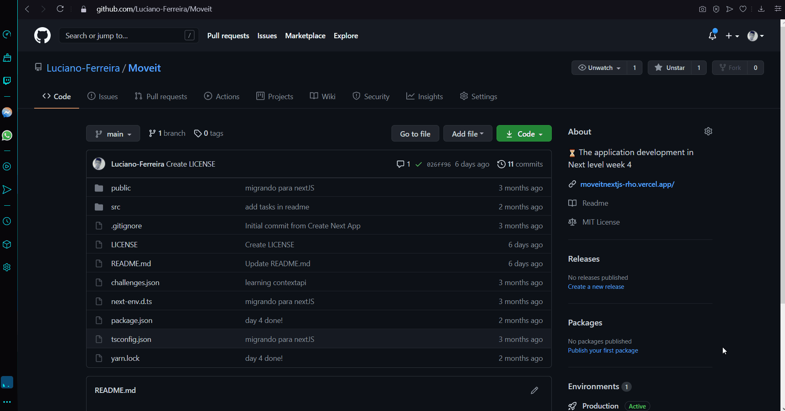

<div align="center">
  
</div>

---
<div align="center" >
  
</div>

Move.it is an App that uses the pomodoro technique, in order to improve your productivity and focus. Developed during Rocketseat's Next Level Week # 4.

[Preview](https://moveitnextjs-rho.vercel.app/)

## Technology used :rocket:

- [js-cookie](https://github.com/js-cookie/js-cookie)
- [NextJS](https://nextjs.org/)
- [React](https://pt-br.reactjs.org/)
- [react-dom](https://pt-br.reactjs.org/docs/react-dom.html)
- [Typescript](https://www.typescriptlang.org/)

## ❓ How to install

### Prerequisites

Before you begin, you will need to have the following tools installed on your machine: [Git](https://git-scm.com), [Node.js](https://nodejs.org/en/) and a package manager [Yarn](https://yarnpkg.com/) or [npm](https://www.npmjs.com/). 

### ⏯️ Run aplication
In your terminal or bash

```bash
# Clone this repository
$ git clone https://github.com/Luciano-Ferreira/Moveit.git

# Access the directory
$ cd Moveit

# Install all dependencies
$ yarn 
# or
$ npm install

# Run the fake API
$ yarn server
# or 
$ npm server

# Run the application in dev mode
$ yarn dev
# or
$ npm run dev

# The application start in http://localhost:3000
```

## :memo: License
This project is under the MIT license. See the [LICENSE](https://github.com/Luciano-Ferreira/Moveit/blob/main/LICENSE) for more information.

---

Made with ♥ by Luciano Silva :wave: [Get in touch!](https://www.linkedin.com/in/lucianof-silva/)
